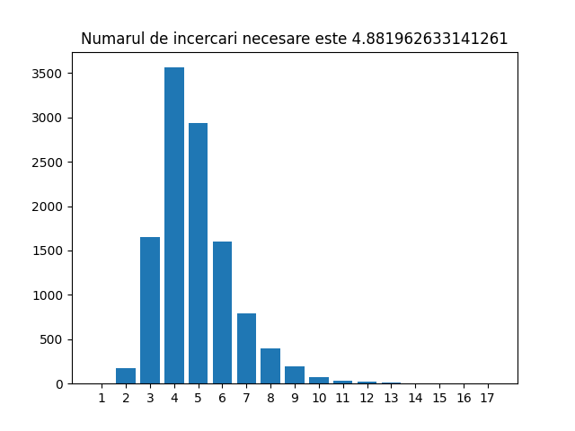

# Arhitectura Sistemelor de Calcul - Proiect 0x00 

Aceasta este o soluție a [Proiectului 0x00 - Jocul Wordle] (https://cs.unibuc.ro/~crusu/asc/Arhitectura%20Sistemelor%20de%20Calcul%20(ASC)%20-%20Proiect%200x00%202022.pdf).

## Cuprins

- [Despre](#despre)
  - [Tema proiectului](#tema-proiectului)
- [Modul de gandire](#modul-de-gandire)
  - [Algoritmul](#algoritmul)
  - [Reflectii](#reflectii)
  - [Python](#python)
- [Echipa](#echipa)
- [Referinte](#referinte)

## Despre

### Tema proiectului

Creati un algoritm care joaca Wordle optim (în medie, ghicește cu un număr
minim – nu neapărat 6 – de încercări un cuvânt de 5 litere).

## Modul de gandire

### Algoritmul

Pentru ca algoritmul sa joace Wordle optim trebuie sa ne legam de Teoria Informatiei, mai exact de conceptul de Entropie, cat si de cateva concepte din teoria probabilitatilor.

Astfel, am calculat din lista de cuvinte frecventa literelor in total, cat si frecventa fiecarei litere in functie de pozitia acesteia in cuvant. 
Apoi am calculat entropia pentru fiecare cuvant in parte folosind probabilitatea fiecarei litere.

In programul wordle.py se preia cel mai bun cuvant "guess" ghicit, apoi se "joaca" Wordle si in functie de datele aflate apeleaza subprogramul run din program2.py care preia acele date si recalculeaza entropia cuvintelor urmatoare presupuse "guess" si le ordoneaza descrescator in functie de entropie.

In final, numarul mediu necesar pentru ghicirea tuturor cuvintelor este aproximativ: 4.88
Timp de rulare total pentru cele 11454 de cuvinte: 9 ore.

### Reflectii

Este acesta cel mai bun numar mediu de incercari pentru ghicirea tuturor cuvintelor? 
Desigur ca nu.

O optimizare majora poate fi facuta prin utilizarea unui string general: abcde. Daca litera ghicita este pe aceeasi pozitie si in cuvantul ghicit, cat si in cuvantul original, atunci string-ul se actualizeaza pe pozitia i cu acea litera. Apoi se cauta urmatorul cuvant de ghicit pe baza acelui string.
In programul curent, guess se cauta pe baza cele mai mari entropii dintre toate cuvintele posibile, apoi se verifica daca toate literele confirmate (fie cu galben, fie cu verde) apar in acesta.

### Python

Versiunea de Python folosita este: Python 3.10.6.
Pentru proiect a fost folosita libraria externa Matplotlib, versiunea 3.6.0.
IDE: PyCharm 2022.2.3 si Visual Studio Code.
Git: 2.38.1.windows.1
Emulatorul de consola Cmder: v1.3.20

## Echipa

Echipa a fost formata din:
- Sîrbu Iulia-Georgiana, grupa 134
- Vidroiu Dana-Maria, grupa 134
- Enache Sabina-Anca, grupa 134
- Nica Maria-Cătălina, grupa 134

## Referinte

- https://stackoverflow.com
- https://www.geeksforgeeks.org/graph-plotting-in-python-set-1/
- https://www.w3schools.com/python/
- https://cs.unibuc.ro/~crusu/asc/Arhitectura%20Sistemelor%20de%20Calcul%20(ASC)%20-%20Curs%200x02.pdf
